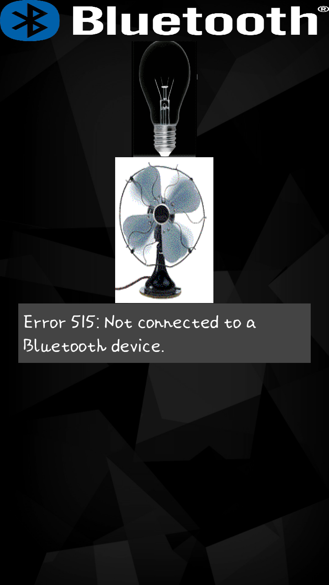

# Z.A.R.S. Home Automation System
My project on bluetooth based home automation system

This project made use of bluetooth controllers along with relay board installed over Arduino board to turn light and fan On/Off using our Android App.

## Some Screenshots:

### Home Screen

### Sign Up 

### Sign In 

### Admin Screen

### Delete User 

### Light turned ON

### Fan turned ON

### Both light and fan turned ON 

